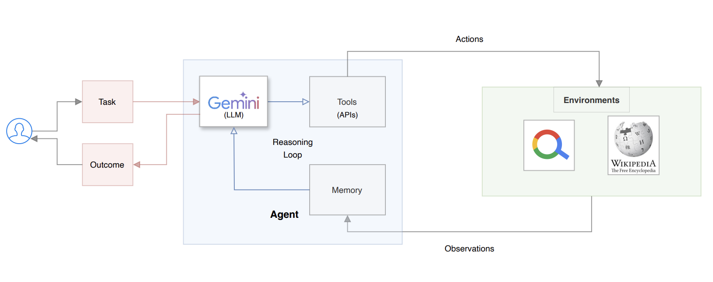
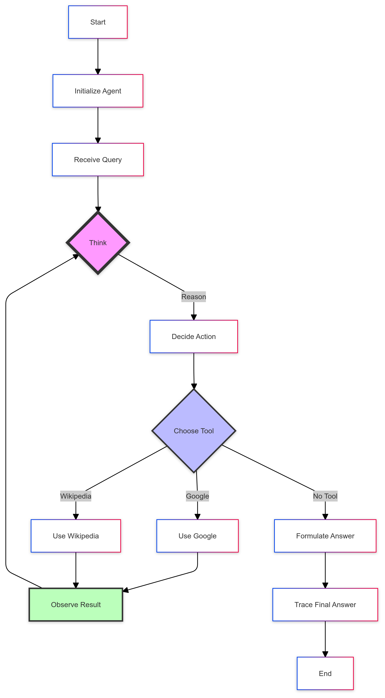

# 🤖 ReAct Agent from Scratch

This repository provides a minimal yet complete implementation of a ReAct (Reasoning + Acting) agent with observability and a lightweight visualization, supporting Gemini by default and optionally Kimi K2 via an OpenAI-compatible interface.



## 📚 Contents

- Step-by-step implementation of the ReAct pattern
- Multiple examples showcasing ReAct agents in action
- Optimizations specific to the Gemini model
- Tools integration (Google Search and Wikipedia)

## 🚀 Getting Started

### Prerequisites

- Python 3.10+
- Git
- Poetry (for dependency management)

### Installation

1. Clone the repository:
   ```
   git clone <your_repo_url>
   cd react-from-scratch
   ```

2. Set up a virtual environment (venv or conda):
   ```
   # venv example
   python -m venv .venv
   source .venv/bin/activate  # Windows: .venv\Scripts\activate

   # or conda example
   # conda create -n react-agent python=3.11 -y
   # conda activate react-agent
   ```

3. Install Poetry (if not already installed):
   ```
   pip install poetry
   ```

4. Install project dependencies:
   ```
   poetry install
   ```

5. Set up environment variables:
   ```
   export PYTHONDONTWRITEBYTECODE=1
   export PYTHONPATH=$PYTHONPATH:.
   ```

### Setting up Credentials

1. Create a `credentials` folder in the project root:
   ```
   mkdir credentials
   ```

2. Set up GCP service account credentials (if using Gemini):
   - Go to the Google Cloud Console (https://console.cloud.google.com/).
   - Create a new project or select an existing one.
   - Navigate to "APIs & Services" > "Credentials".
   - Click "Create Credentials" > "Service Account Key".
   - Select your service account, choose JSON as the key type, and click "Create".
   - Save the downloaded JSON file as `key.json` in the `credentials` folder.

3. Set up SERP API credentials:
   - Sign up for a SERP API account at https://serpapi.com/.
   - Obtain your API key from the dashboard.
   - Create a file named `key.yml` in the `credentials` folder.
   - Add your SERP API token in the following format:
     ```yaml
     serp:
       key: your_serp_api_key_here
     ```

Note: The `credentials` folder is included in `.gitignore` to prevent sensitive information from being committed.

## 🛠️ Project Structure

- `src/tools/`: Contains implementations for Google Search (via SERP API) and Wikipedia search.
- `src/react/`: Houses the core ReAct agent implementation.
- `data/input/`: Stores input prompts for the ReAct agent.
- `data/output/`: Contains output traces from example runs.

<p align="center">
    
</p>

## 🖥️ Usage

1. Ensure you're in the project root directory with your virtual environment activated.

2. Configure environment (choose Gemini or Kimi):
   - Gemini (Vertex AI):
     ```bash
     export GOOGLE_APPLICATION_CREDENTIALS=/absolute/path/to/key.json
     # model name comes from config/config.yml -> model_name
     ```
   - Kimi K2 (OpenAI-compatible Chat Completions):
     ```bash
     export PROVIDER=kimi
     export KIMI_API_KEY=YOUR_KIMI_API_KEY
     export KIMI_BASE_URL=https://api.moonshot.cn/v1
     export KIMI_MODEL=kimi-k2-0905-preview
     ```

3. Run the ReAct agent:
   ```
   python -m src.react.agent
   ```

3. The agent uses the prompt from `./data/input/react.txt` and generates output traces in `./data/output/`.

4. To run individual tools:
   - Google Search: `python src/tools/serp.py`
   - Wikipedia Search: `python src/tools/wiki.py`

5. For a non-agentic approach with programmatic routing:
## 🔥 Smoke Test (Kimi)

1) Ensure you exported the Kimi env vars as above.

2) Run the agent once to produce traces:
```bash
python src/react/agent.py
```

3) Start the Streamlit trace viewer:
```bash
python -m streamlit run app/trace_viewer.py
```

Expected:
- `data/output/trace.jsonl` contains events: think/decide/act/final/stats, with `api_calls/token_in/token_out` populated for Kimi responses.

   ```
   python src/tools/manager.py
   ```

## 📄 License

This project is licensed under the MIT License. See the [LICENSE](LICENSE) file for details.

## 📚 References

For a detailed explanation of the ReAct pattern and this implementation, check out this accompanying Medium article: 
[[Building ReAct Agents from Scratch: A Hands-On Guide using Gemini](https://medium.com/google-cloud/building-react-agents-from-scratch-a-hands-on-guide-using-gemini-ffe4621d90ae)]

For a Agent Visualization, check out this accompanying Medium article: 
[[Agent Visualization](https://generativeai.pub/building-a-react-agent-from-scratch-a-beginners-guide-4a7890b0667e)]